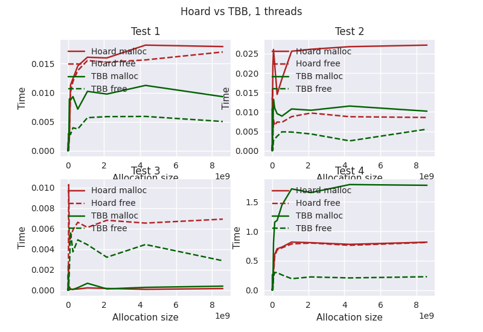
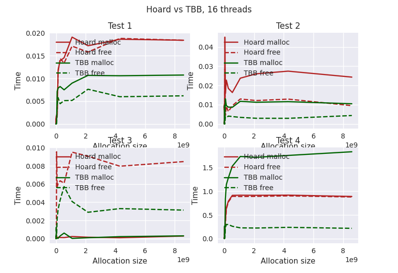

# Benchmarking allocators

This is a small repo contaning some kind of benchmarks for libstdc++'s malloc compared to
TBBs scalable_malloc.

## Build

This project is build using CMake (3.15 and newer), all dependencies are pulled in during configuration time using
[CPM](https://github.com/TheLartians/CPM.cmake) (Sorry I went a little over board using the command line arguments,
cxxopt is damn slow to compile, gotta replace it).

So the usual CMake steps are required from the root directory:

```bash
mkdir build 
cd build
cmake .. -DCMAKE_BUILD_TYPE=RELEASE -GNinja
ninja 
```

### Run benchmarks 

Then from there just call `main` from the build folder. See `main --help` for all the possible configurations.
 
### Using Hoard
 
Just for fun, I also tried using [Hoard](https://github.com/emeryberger/Hoard). It can be preloaded and then replaces
libstdc++'s allocator.

I also pull the repository in using CPM, so all we have to do:

```bash
ninja hoard
LD_PRELOAD=<path/from/previous/command>/libhoard.so ./main 
```

The build step prints out the path, where CPM puts hoard and where the final libary file is. So just look at the output
and run it.

## Results

Okay, I had little time to look into the results in-depth but yeah here we go:

All of the test are run on my desktop using a AMD Ryzen 7 3700X 8-Core 16 Thread machine with 16 GB of Ram.
Take all of the benchmark with a grain of salt. I keep my browser running in the background, so there could be a tone
of noise in there.

The test cases are labled as Test 1 to 4 in the pictures, as it was just so noisy.

Test 1 allocates a power of two buffer and then directly frees it. It does so for a repeated amount of times
then increments the size.

In Test 2, first for a fixed number of times, chunks are allocated of all the same size, and then freed all
together. Then the size is incremented to the next power of two.

Test 3 is very similar to test 4, but the chunks are now all randomly sized in the range of the next smaller power
of two and to the next larger power of two.

Test 4 is the only test that actually takes threading into account. The test runs for a number of times, and each
iteration it allocates a random amount of chunks and then frees a random amount of those in a random order. This
way allocations build up and sometimes only small amount is freed, and sometimes larger amount of it are freed.

### Hoard vs TBB 
 
With that out of the way, let's look a little into Hoard vs TBB. First single threaded results.


 
And the results for 16 threads. 
 

